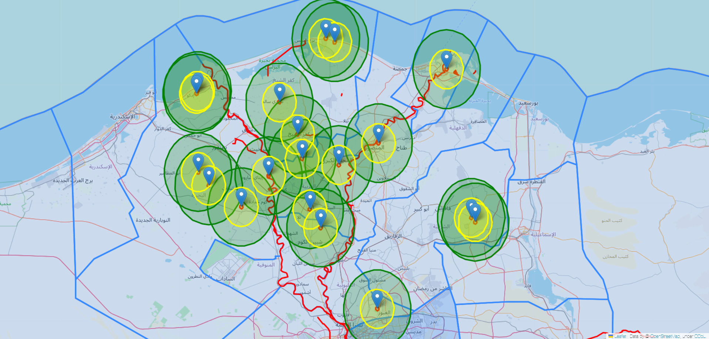
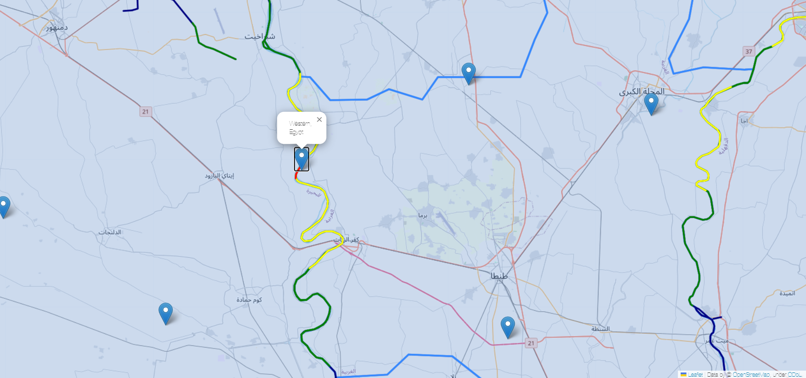
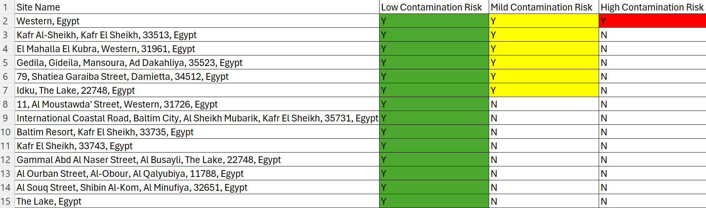

# Geospatial Analysis of Contamination Risk in Egypt

This repository contains the code and data related to web scraping, data cleaning, and geospatial analysis of contamination risk in Egyptian River the Nile. The project aims to gather, process, and visualize data on waste sites globally, with a focus on understanding contamination risks in the Nile Delta region.

## Table of Contents

- [Introduction](#introduction)
- [Web Scraping](#web-scraping)
- [Data Cleaning](#data-cleaning)
- [Geospatial Analysis](#geospatial-analysis)

## Introduction

This project showcases the geospatial analysis of contamination risks in Egypt, focusing on the Nile Delta region. Using Python, we aim to highlight the impact of waste sites on the environment and public health.

## Web Scraping

The web scraping phase of this project was implemented using Python and the Beautiful Soup library. This process involved extracting data from various websites to collect information related to waste sites globally.

**Key Steps:**

- Used the requests library to send HTTP requests to relevant websites.
- Employed two web scraping bots to gather comprehensive data on waste sites worldwide.
- Iterated through multiple web pages to compile a list of waste sites.
- Used Beautiful Soup to parse the HTML content and extract specific data elements, such as waste site locations, types, and contamination levels.

**Challenges:**

- The diverse structure of websites posed challenges in data extraction and parsing.
- Ensuring the accuracy and completeness of the collected data.

## Data Cleaning

Cleaning the data involved eliminating duplicates, changing column data types, and preparing the data for geospatial analysis using Pandas and GeoPandas.

## Geospatial Analysis

The geospatial analysis was conducted using GeoPandas to handle geospatial data and Matplotlib for visualization. The analysis focused on creating geospatial visualizations to illustrate contamination risks in the Nile Delta region of Egypt.

**Geospatial Visualizations:**

Geospatial visualization highlighting the distribution of waste sites and contamination risk levels.

**Data Analysis:**

The table of the places with contamination risk .

